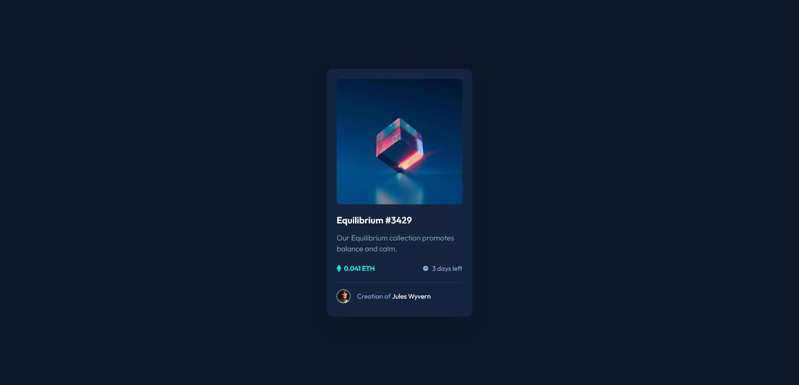

# Frontend Mentor - NFT preview card component solution

This is a solution to the [NFT preview card component challenge on Frontend Mentor](https://www.frontendmentor.io/challenges/nft-preview-card-component-SbdUL_w0U).

## Table of contents

- [Overview](#overview)
  - [The challenge](#the-challenge)
  - [Screenshot](#screenshot)
  - [Links](#links)
- [My process](#my-process)
  - [Built with](#built-with)
  - [What I learned](#what-i-learned)
  - [Continued development](#continued-development)
- [Author](#author)
- [Acknowledgments](#acknowledgments)

## Overview

### The challenge

The challenge is to build out this preview card component and get it looking as close to the design as possible.

Users should be able to:

- View the optimal layout depending on their device's screen size
- See hover states for interactive elements

### Screenshot

### Links

- Solution URL: [https://www.frontendmentor.io/solutions/first-attempt-at-nftpreviewcardcomponent-and-test-submit-Byz_7e2m5](https://www.frontendmentor.io/solutions/first-attempt-at-nftpreviewcardcomponent-and-test-submit-Byz_7e2m5)
- Live Site URL: [https://brianyeadon.github.io/nft-preview-card-component/](https://brianyeadon.github.io/nft-preview-card-component/)

## My process

Build out for mobile first, account for desktop through media queries, and add the interactive elements at the end. Complete the challenge with a refactor and testing.

### Built with

- Mobile-first workflow
- CSS custom properties
- CSS Flexbox

### What I learned

How to apply an interactive overlay to an image with ::before and ::after pseudo elements in combination with :hover and :focus pseudo classes.

### Continued development

After experimenting with overlays I plan to learn more about how to make use of ::before and ::after as well as the :focus-visible pseudo class.

## Author

- Frontend Mentor - [@brianyeadon](https://www.frontendmentor.io/profile/brianyeadon)

## Acknowledgments

Thanks to Grace [@grace-snow](https://www.frontendmentor.io/profile/grace-snow) for her feedback to [@mikeH58](https://www.frontendmentor.io/profile/mikeH58)'s NFT preview card component solution. I used these instructions to apply the interactive overlay before experimenting with the code.
